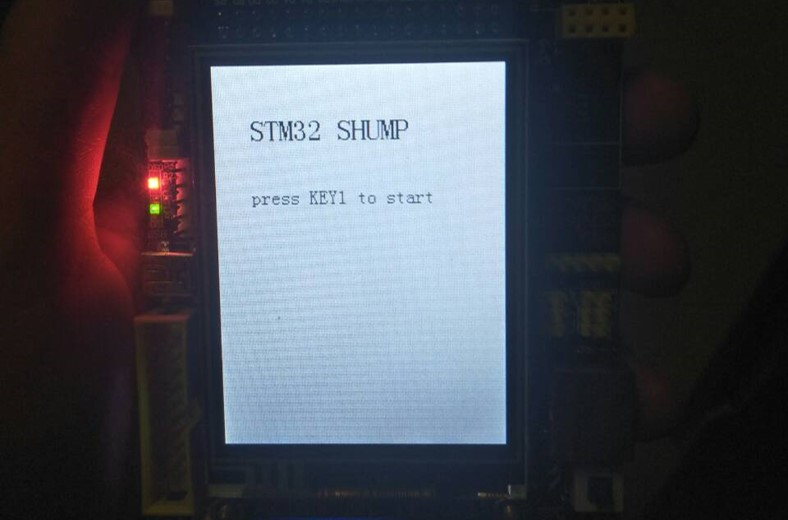
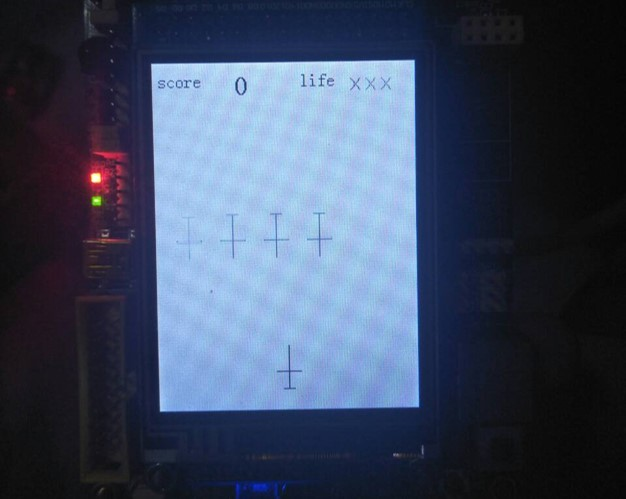
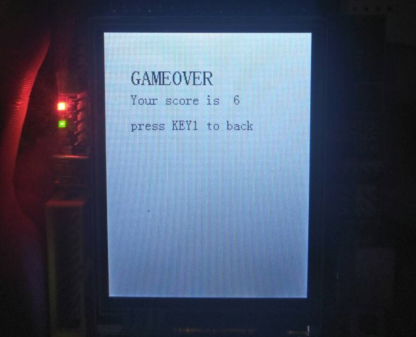

# Plane-Fight
The work is done as the final project in CS301 Embedded System and Microcomputer Principle 2019 autumn @SUSTech

## Modules design
### Interface module
It contains 3 interfaces: start-page, play, end-page. For each interface, it must use other 3 module to fill it.
### EXIT module
It needs to process keys and LEDs in every interface. For example, in start interface, it needs to detect whether key-1 is pressed.
### Running module
It processes different login parts of this project. For example, when bullets hit plane, it should call "hit it" function--eliminate bullet and plane.
### Painting module
It paints different objects, such as lives, enemy planes and so on.

## Main functions
### Start game
In start interface, if we press key-1, it will go into play interface

### Play game
in this stage, your score(initial is 0), remaining life(initial is 3), enemy and player's positions are shown.
> Three features of the game:
1. operation: When you press key-0 it will move right, if you press key-1 it will move left, if you press wk_up it will fire. (Notice, enemy will not fire)
2. crash: If player crashes to enemy, life -1(when life is 0 then game over) and green LED blinks. If player's bullet hit enemy, score +1 and red LED blinks.
rounds: In first 
3. rounds: In first 3 rounds, enemy is 1 plane and speed is 1. After 3 rounds the number of enemy will increase (up to 6) and speed will increase(up to 5). When all enemy is killed or they move to the bottom of scene, it will go to next round.

### End game
In this stage, your scores will be shown. Press key-1 to go back.

## Development platform
### Hardware
ARM-STM32 development board, J-Link /St-Link
### Software
Microsoft Windows 10, flyzMcu.exe, sscom5.13.1.exe, STM32CubeIDE

## Play platform
ARM-STM32 development board

> Feel free to enjoy it! 